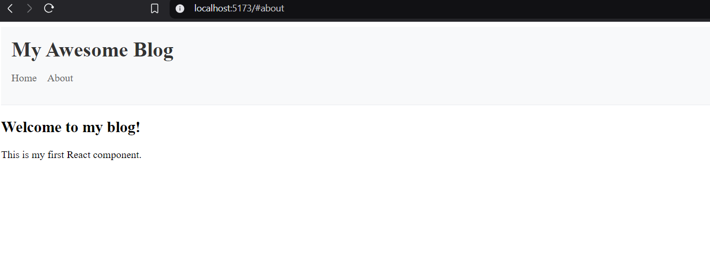
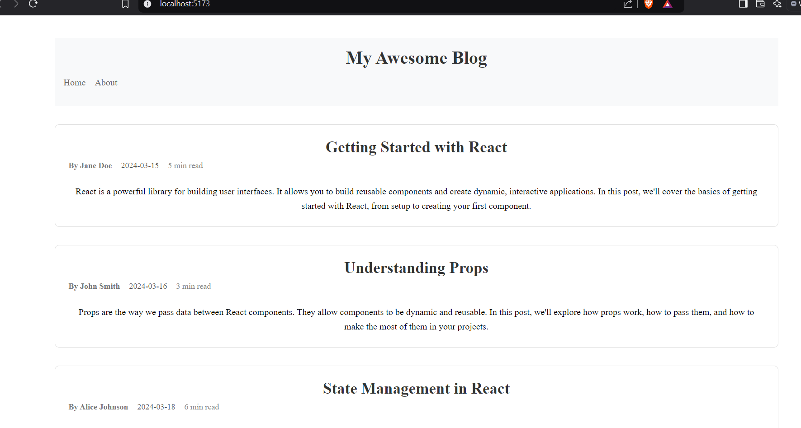
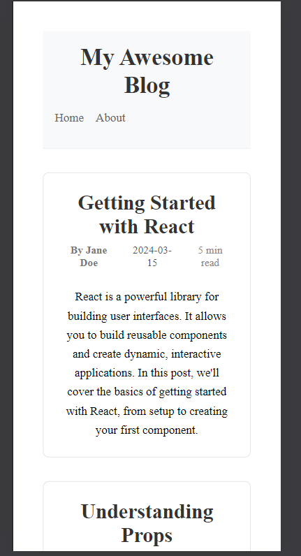

Assignment 0
# My React Blog

A blog platform built with React and Vite.

## Setup Instructions
1. Clone the repository
2. Run `npm install`
3. Run `npm run dev`
4. Open http://localhost:5173 in your browser

project structure:
my-blog/
├── src/
│   ├── components/
│   │   └── Header.jsx
│   ├── index.css
│   ├── App.jsx
│   └── main.jsx
├── public/
│   └── index.html
├── package.json
└── README.md

Explanation
Header.jsx: This file contains a Header component that displays the blog title and a navigation menu with links to the Home and About sections.
index.css: Includes styles for the Header component to enhance its appearance.
App.jsx: The main entry point of the application, which imports the Header component and renders the main content of the blog.

screenshot:

what I Learned:

Component Creation: Learned how to create and export a reusable React component (Header) and how to include it in the main App component.
CSS Styling: Understood how to use CSS for styling individual components to keep the design consistent across the project.
Project Structure: Gained experience organizing a React project with separate folders for components and styles to maintain a clean and scalable structure.

Assignment 1:

desktop view:

mobile view:

New Features Added:
Modular CSS: Switched from global CSS to CSS modules for BlogPost and BlogList components to ensure styles are scoped locally.
Responsive Design: Added responsive styles to ensure the blog posts look good on both desktop and mobile devices.
Reusable Components: Created a reusable BlogPost component and a BlogList component that dynamically renders posts from a data source.
PropTypes Validation: Implemented PropTypes to enforce type checking, ensuring that the components receive the expected data types.